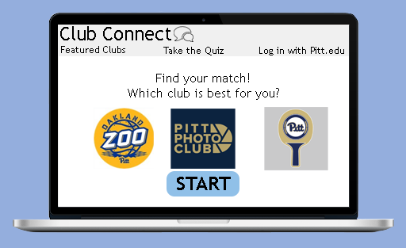

# Club Connect
Many clubs are struggling getting new members due to Covid preventing the club fair and limiting activities. Club Connect is a website that helps students and clubs connect. The website will start by giving a general personality quiz to find out the users interests and then would give suggestions based on these interests. Other features include a "featured clubs" page where each week several new clubs are chosen and promoted. The user can also follow clubs that they have joined or are simply interested in. The events and activities of these clubs will be posted on their own page so that the user can easily get involved.

## Features:

### User Quiz
Users will take a preliminary quiz to help reccommend clubs based on their answers. All clubs have associated tags and these tags will correlate to answers in the quiz. The tags with the highest result will be the clubs that are reccommended to the user at the end of the quiz.
  - script and implementation - work in progress

Below is a design of the "Quiz" page

### Website Main Layout
  - design and implementation - work in progress

### Featured Clubs Page
Part of the website that promotes new clubs. 
  - Clicking "Learn More" will redirect the user to the club page.
  - work in progress 
Below is a design of the "Featured" page

### User Clubs Page
Users can follow clubs that they are interested in and will get information about these clubs on their page.
  - work in progress 

Below is a design of the "Following" page

## Specifications
  - Website created using HTML and Bootstrap
  - Quiz implementation using JavaScript

## Organization
Each team member was given a role. The members worked in assigned roles to ensure time was managed effectively.
### Team Roles
  - James Baker
  - Matt Jaros
  - Andrew Potter
  - Chloe Tassone: created designs for the main website pages (quiz page, featured page, and following page)
  - Catrina Wolf  

## Quality
During the time of COVID-19, there have been many regulations put into place. This caused difficulties for clubs to find new members. It also caused isolation for many students. Club connect allows students to interact with clubs and its members. The club creates a space where students can have a sense of normalcy.

## Current Status
A basic website has been created for Club Connect; it is still in its early stages. A quiz and other clubs can be viewed on the page. The quiz is interactive for users.
### Future Directions
Moving on, different pages will be needed. This will allow more interaction with the site. Several clubs should be added to increase the amount of clubs that may be reached. 

[//]: # (These are reference links used in the body of this note and get stripped out when the markdown processor does its job. There is no need to format nicely because it shouldn't be seen. Thanks SO - http://stackoverflow.com/questions/4823468/store-comments-in-markdown-syntax)

   [dill]: <https://github.com/joemccann/dillinger>
   [git-repo-url]: <https://github.com/joemccann/dillinger.git>
   [john gruber]: <http://daringfireball.net>
   [df1]: <http://daringfireball.net/projects/markdown/>
   [markdown-it]: <https://github.com/markdown-it/markdown-it>
   [Ace Editor]: <http://ace.ajax.org>
   [node.js]: <http://nodejs.org>
   [Twitter Bootstrap]: <http://twitter.github.com/bootstrap/>
   [jQuery]: <http://jquery.com>
   [@tjholowaychuk]: <http://twitter.com/tjholowaychuk>
   [express]: <http://expressjs.com>
   [AngularJS]: <http://angularjs.org>
   [Gulp]: <http://gulpjs.com>

   [PlDb]: <https://github.com/joemccann/dillinger/tree/master/plugins/dropbox/README.md>
   [PlGh]: <https://github.com/joemccann/dillinger/tree/master/plugins/github/README.md>
   [PlGd]: <https://github.com/joemccann/dillinger/tree/master/plugins/googledrive/README.md>
   [PlOd]: <https://github.com/joemccann/dillinger/tree/master/plugins/onedrive/README.md>
   [PlMe]: <https://github.com/joemccann/dillinger/tree/master/plugins/medium/README.md>
   [PlGa]: <https://github.com/RahulHP/dillinger/blob/master/plugins/googleanalytics/README.md>
